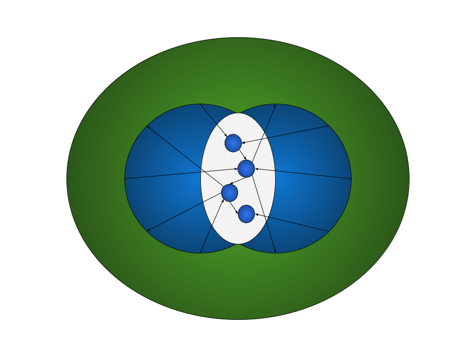

<div align="center">

</div>

### भास्कर - A Dynamic object functional programming language

Bhaskara is an experimental interpreted object functional language focused towards extreme flexibility, expression of metalinguistic abstractions(trying to support language oriented programming) and the eventual goal of creating a powerful reflective/meta-reflective system with the capabilities of self-modifying(homoiconic) code, Aspect Oriented Programming and dynamically changing runtime semantics(by providing a Metaobject Protocol).

This project serves as an explorational workbench for experimenting and testing idiosyncratic linguistic abstractions and language constructs, design patterns, dsls, runtime semantics etc. 

##### Influenced directly or indirectly by
Javascript, Self, F#, Python, Go, Smalltalk, OCaml, Haskell, Scala, Lisp, CLOS, Scheme, Clojure, Lua, C, Wolfram Language, Racket

#### Example code
```
def fac(n) = if n == 0 then 1 else n * fac(n-1)

pfac <- fac >> print

for i in 1..13 do go pfac(i)

def fib(n) => match n with
                  | 0 => 0
                  | 1 => 1
                  | _ => fib(n-1) + fib(n-2)

8 |> fib |> print

def cons(head, tail) => [head, tail]
def car(l) => force l[0]
def cdr(l) => force l[1]

def add1(n) {
    cons(n,lazy add1(n+1))
}

def map(fn, l) {
    cons(fn(car(l)), lazy map(fn,cdr(l)))
}

n := map(add1(0), def(v) => v**2)
for i in 0..20 {
    print <| car(n)
    n = cdr(n)
}

def reader(ch) => while true do ch.recv() |> print
def writer(ch,n) => for i in 0..n do ch.send(i)

ch1 := channel()
go reader(ch1)
writer(ch1,100)
```

## Currently supports
> The codebase is under heavy developement(in a primitive quality state) and constantly updated
* Control Flow
    * if-elif-else
    * for loop
    * while loop
    * pattern matching with guards
        1. Literal based 
        2. Variable based
        3. Wildcard based
* Functions
    * Normal functions
    * Lambdas and Closures
    * Decorators
* Object
    * Object literals
    * List literals
    * Indexing `name[exp]` syntax
    * Dot syntax `obj.prop`
    * Optional chaining
    * Method invocation
    * Basic operator overloading
    * Prototypal Inheritance
* Concurrency
    * `go` syntax supported (currently assigns a thread from a thread pool)
    * `go` expression returns an Async Future/Promise which is fulfilled with the return value of routine
    * `channel` currently supported through objects(will give syntactic support through operator overloading in the future)
* Lazy expressions are supported
* Embedded S-Expression support
    * Allowed to pass around as literals
    * Working on allowing templatization

## Under implementation
> This also includes long term goals
* Multiple prioritized inheritance & Sender path tie breaker resolution
* Sum types (Disjoint union types)
* Module system
* Python FFI
* Tail call optimization
* In built testing
* Destructuring
* Optimized Goroutine scheduler
* String templates and Tagged string literals
* Scala like `_` based lambda literal sugar
* Haskell style List Comprehensions
* Typeclasses
* RegExp Literals
* Proxy and AOP
* Sugar syntax based on AOP for DbC (Design by Contract e.g preconditions, postconditions etc.)
* Monadic bind operator and Do notation
* Additonal call by name eval strategy for thunks
* Dynamically scoped functions/thunks
* Coroutines, async-await(more specific form of do notation?) and First Class Continuations?
* Homoiconic transforms
* Lisp style Macros
* Code quotations
* Self hosted transpiler to Javascript
* Gradual typing (Based on gradually typed hindley-milner with dynamic type inference: [ref](https://dl.acm.org/doi/10.1145/3290331))
* Runtime persistance to JSON or Custom image format
* Unicode support
